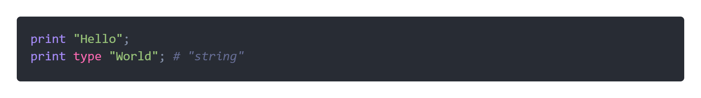
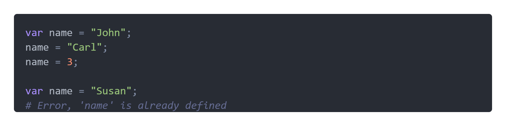
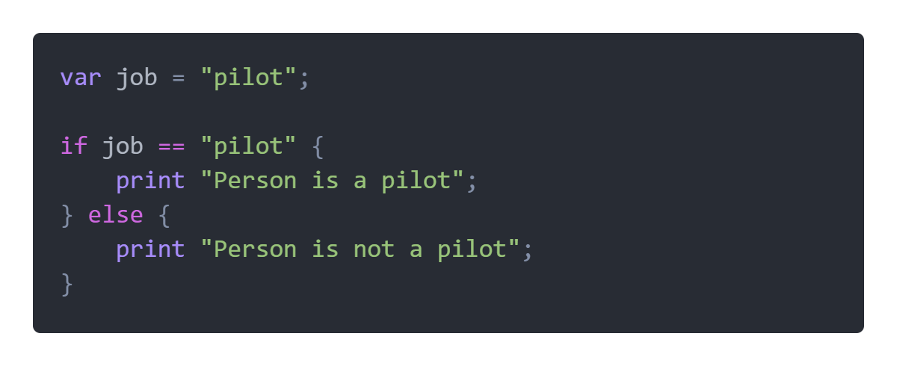
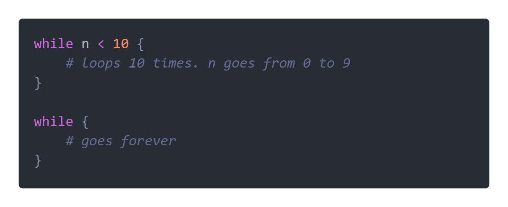
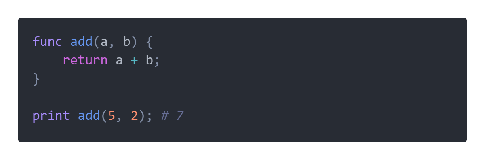

# **Syntax**

### **Syntax overview**

- [Expressions](#expr)
- [Print and Type](#prt)
- [Variables](#var)
- [If statements and logic](#if)
- [While and repeat](#while)
- [Break, skip, and exit](#break)
- [Functions](#func)

<br>

### <a id="expr"></a> **Expressions**

Fizz features a lot of standard syntax similar to other languages. For example, all normal expressions using the basic arithmetic and logic operators will work in Fizz, including the modulo operator and the hat operator. Plus can also be used for joining strings.

```
4 % 2 == 0
3 ^ 2 == 9
"Hello" + "World"
```

Fizz is dynamically typed, but will not convert types in expressions. Instead and error is raised when types do not match.

<br>

### <a id="prt"></a> **Print and Type**

In Fizz, `print` is a _statement_, not a function. However, `type` is an _operator_, not a function, and gives a string value.



<br>

### <a id="var"></a> **Variables**

You can declare a variable using the `var` statement. The value can be re-assigned later and even change type.



Local variables override global ones.


You can use shorthand assignment operators too:


You can also use the `+=` operator with strings.

<br>

### <a id="if"></a> **If statements and logic**

Fizz features simple if and else statements, but not else-if. The 'and' operator is `&` and 'or' is `:`.



<br>

### <a id="while"></a> **While and repeat**

Fizz has a while statement similar to most other languages. If you leave the expression field empty it will just run forever.



(Temporary: will be replaced with a range statement) The repeat statement is a little different. It is a condenced 'for' loop. You first declare a variable name followed by a legal repeat operator and range. Currently, only `<` is allowed.

```
repeat n < 10 {
    # loops 10 times. n goes from 0 to 9
}
```

<br>

### <a id="break"></a> **Break, skip, and exit**

- `skip` skips to next iteration in loop
- `break` breaks out of loop
- `exit` stops program execution

<br>

### <a id="func"></a> **Functions**

You can declare a function using the `func` keyword.


